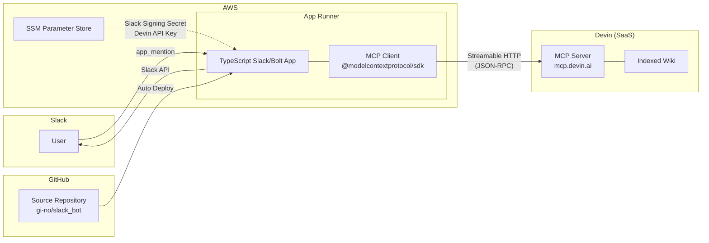
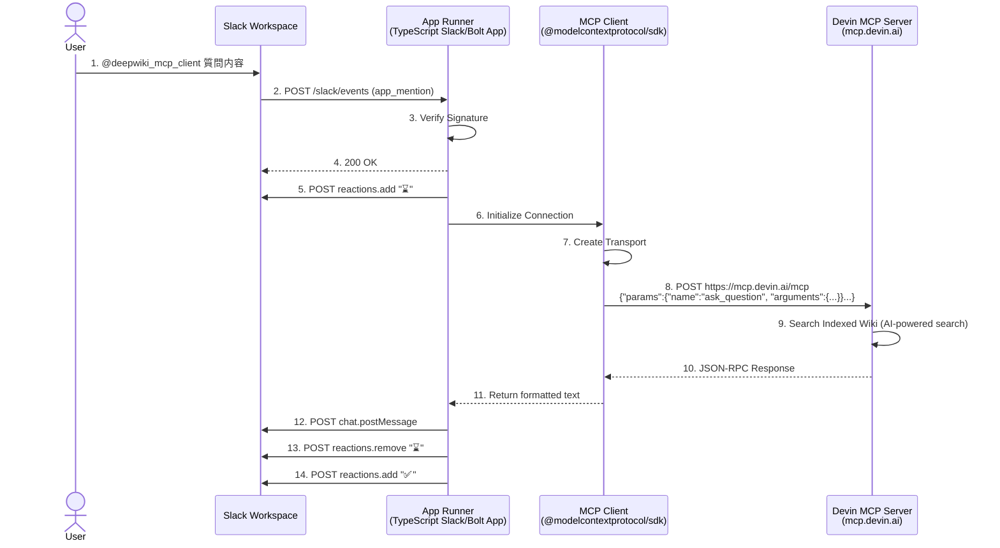

# Slack Apps x Devin MCP
## 自然言語問い合わせbotを作った話

<!--
タイトルを読み上げて次へ。
-->

---

# ToC

- 背景・課題
- アーキテクチャ
- Why this stack?
- リクエストフロー
- デモ
- 現状と今後

<!--
全体像を伝える。10分なのでサクサクいく。
-->

---

# 背景・課題

<v-clicks>

- AI WG の中で、生成AIに仕様書などドキュメントの管理生成をやらせられないかという話があった。

- そこで、Devin の DeepWiki がツールとしてあるということで、とりあえず作ってもらった。

- :twemoji-light-bulb: 機能として `Ask Devin` という質問機能があって、仕様調査に使えるかもとなったので試すことにした。

</v-clicks>

<!--
1つずつ順番に出す。
3つ目が今回の発端。Ask Devinが問い合わせ対応に使えるのではという仮説。
wiki作成作業をしてくれた人へ感謝。
気になる人はAI WGの議事録も見てみてください。と伝える。
-->

---

# アーキテクチャ

<!--
全体構成を俯瞰。左からSlack → AWS App Runner → Devin MCP Server。
GitHub連携で自動デプロイ。シークレットはSSM管理。
次のスライドで「なぜこの構成にしたか」を説明する。
-->

---

# Why this stack? (1/2)

| 観点 | 選択肢 | 採用 | 理由 |
|------|--------|:----:|------|
| ナレッジソース | **Devin DeepWiki** | **→** | 既にDevin導入済み。Wiki問い合わせは [**ACU消費なし**]{.underline} |
| | DeepWikiサービス | | Devin DeepWiki より先に試すほどじゃなかった |
| | 自前RAG構築 | | 知見なしで最初っからやるものじゃない |
| 接続方式 | **MCP** | **→** | Devinが [**MCP エンドポイントを公式提供**]{.underline} |
| | REST API | | ACUを消費する(有料)、コードを読むが編集もできる |

<!--
ナレッジソース: Devin導入済みだったので自然な流れ。ACU消費なしが決め手。
接続方式: REST APIはACU消費あり。sessionが上がってしまう形で @Devinでメンションした時と同じ振る舞いで、コードベースの編集やら何やらできちゃうのでガードの意味も込めてMCPを選択。
wikiに対してはmcpが公式に提供されているので、自然にこちらを選択。
-->

---

# Why this stack? (2/2)

| 観点 | 選択肢 | 採用 | 理由 |
|------|--------|:----:|------|
| インターフェース | **Slack Bot** | **→** | 回答がチャンネルに残り [**他の人も参照できる**]{.underline} |
| | Web UI/CLI | | 非エンジニアが使いにくい |
| インフラ | **App Runner** | **→** | [**GitHub連携で自動デプロイ + 料金が安い**]{.underline} |
| | Lambda | | App Runnerより高い |
| | ECS | | 小規模botにはオーバースペック |

<!--
Slack: 普段使いのツール上で完結。問い合わせ対応に付け加えたいのでslack一択。回答が残るのでナレッジの蓄積にもなる。
App Runner: pushするだけでデプロイ。Lambdaよりコスト安。
-->

---

# リクエストフロー

<!--
左から右へ流れを追う。
ポイント: 砂時計リアクション → 回答 → チェックマーク。ユーザーに処理中であることが伝わるUX。
レスポンスは3〜15秒程度。
-->

---
layout: lead
---

# デモ

<!--
実際にSlack上でメンション → 回答が返るところを見せる。
質問例: 「DBの接続方法は？」「認証の仕組みは？」など。
うまくいかない例も見せると正直で良い。
wiki commandはいいけど page commandは全部返ってきちゃうので塞ぐかも。
-->

---

# 現状

<Label color="attention">検証段階</Label>

まだ利用実績が少なく精度評価はこれから。

<v-clicks>

- ざっくり概要を把握したい問い合わせには使えている例あり
- 厳密な仕様把握には情報が足りない可能性もある
- そもそも正確でない回答もあるのは生成AIな以上当然ある

</v-clicks>

<!--
検証したいことを伝える。
良い例と限界を両方示すことで信頼感を出す。
-->

---

# 今後

AI生成ドキュメントの活用は [**プラクティスが固まってないまだ手探りの段階**]{.underline}。

<v-clicks>

- DeepWiki は 2025年4月リリース。ベストプラクティスはまだ確立されていない
- Google Code Wiki、GitHub Copilot Spaces など主要プレイヤーも参入したばかり

</v-clicks>

<v-click>

**だからこそ今やって知見を貯める価値があるはず**

</v-click>

<v-clicks>

- Devin DeepWiki に関しては Steerable Wiki (`.devin/wiki.json`) でWiki品質を制御する仕組みは既にある
- いつかは Confluence 等の社内ドキュメントもナレッジソースとして接続していきたい

</v-clicks>

<!--
業界動向 → 「だからこそ」のメッセージを溜めて出す。
Steerable Wikiは具体的なネクストアクション。
最後は前向きに締める。
-->

---
layout: end
class: text-center
---

# Thank you!

<!--
sli.do みる
-->
